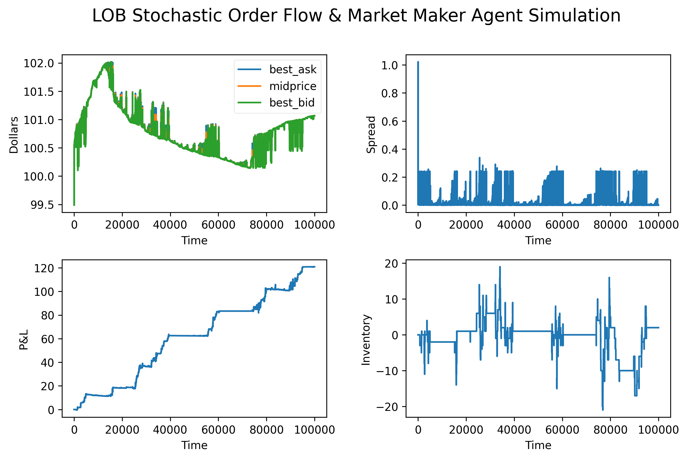

# Limit Order Book Simulator

A limit order book engine and market making simulation in Python.

## Summary

Simulates a limit order book with stochastic order flow, informed traders, and an Avellaneda-Stoikov market making agent that manages inventory risk via reservation price adjustment. Includes grid search and Bayesian parameter optimisation.



## Features

- **Order book**: price-time priority matching with lazy cancellation
- **Market making**: Avellaneda-Stoikov agent with rolling variance estimation
- **Order flow**: stochastic limit, market, and cancel orders
- **Informed traders**: hidden true price random walk with adverse selection
- **Parameter optimisation**: parallelised grid search and Bayesian optimisation using Optuna

## Installation 

Requires **Python 3.10+**.

```bash
pip install -r requirements.txt
```

## Usage

Run the program from the `src` directory:
```bash
cd src
python main.py
```

Select a mode when prompted:
- `S`: run and plot simulation
- `G`: run grid search parameter optimisation
- `B`: run Bayesian parameter optimisation

## Project Structure
```
src/
├── main.py          # Entry point and config
├── simulation.py    # Order flow simulation
├── orderbook.py     # Limit order book engine
├── marketmaker.py   # Avellaneda-Stoikov agent
└── optimiser.py     # Parameter optimisation
```